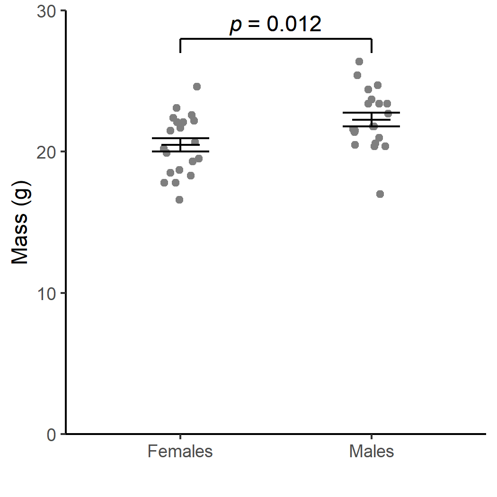

```{r setup, include=FALSE}
knitr::opts_chunk$set(echo = FALSE, 
                     warning = FALSE,
                     message = FALSE,
                     fig.retina = 3)
```

```{r packages}
source("R/00-pkg.R")
```

# Introduction

The chaffinch, *Fringilla coelebs*, is one of the most widespread and common passerine bird species. It is sexually dimorphic in plumage with males being brightly coloured with a blue-grey cap and rust-red underparts and females being grey-brown with paler underparts.  This study aimed to determine whether *F.coelebs* were also sexually dimorphic in size.

# Methods
```{r import}
# chaff_tidy
source("R/01-import.R")
```

We randomly sampled male and female birds on the stray and determined their mass with spring scales. Analysis was carried out with R version 4.0.2 and tidyverse packages.

```{r summarise}
source("R/02-summarise.R")
```


# Results
```{r table}
knitr::kable(chaff_summary, digits = 2)
```


```{r plot, out.height="400px"}
source("R/04-plot.R")

```


# Discussion
